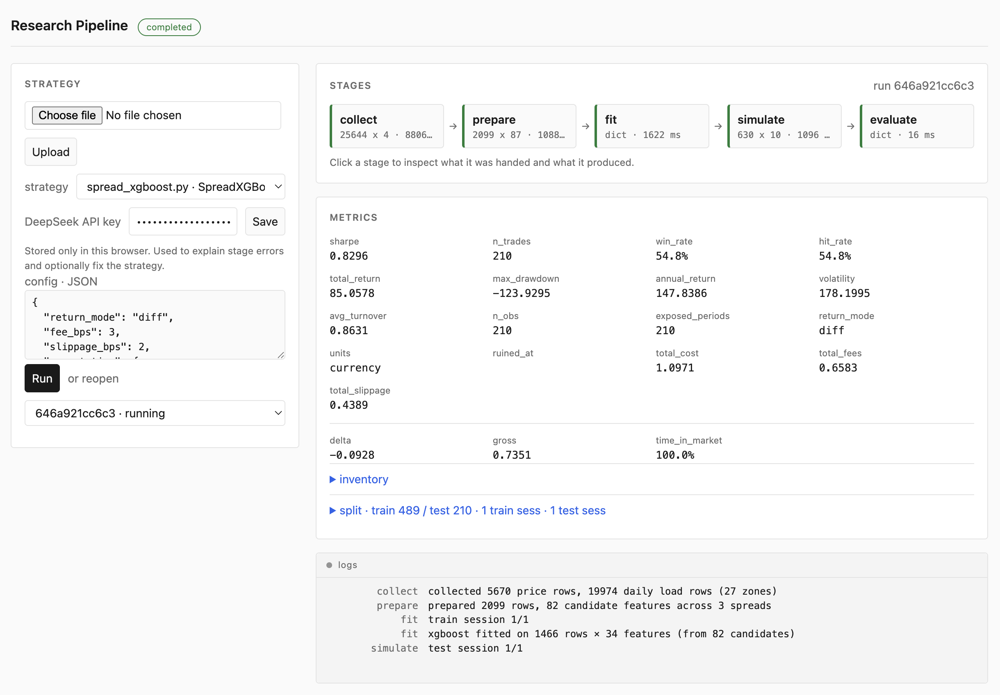

# Research Pipeline



Upload a strategy, run it stage by stage, inspect any stage that breaks.

```
collect → prepare → fit │ simulate → evaluate
└──── your Strategy ────┘└── pipeline-owned ──┘
```

You write `collect`, `prepare`, and optional `fit`. `on_tick` is called from
`simulate`: the engine fills, tracks inventory, and marks PnL. Each stage is a
subprocess with a checkpoint, so a broken stage can be resumed without
recomputing the ones before it.

## Quickstart

```bash
uv venv .venv
uv sync
uv run uvicorn backend.pipeline.api:app
```

Open <http://localhost:8000>, upload a strategy, edit config, run.

```bash
curl -s -F file=@backend/strategies/spread_meanrev_toFix.py localhost:8000/strategies
curl -s -X POST localhost:8000/runs -H 'content-type: application/json' -d '{
  "strategy_id": "<id>",
  "config": {"pairs": [["FRA","DEU"]], "return_mode": "diff", "cost_bps": 5}
}'
curl -s localhost:8000/runs/<run_id>
curl -s localhost:8000/runs/<run_id>/artifacts/metrics.json
```

## Writing a strategy

```python
from backend.pipeline.contract import Strategy

class MyStrategy(Strategy):
    def collect(self, config): ...
    def prepare(self, raw, config): ...          # ts, asset, price + features
    def fit(self, prepared, config): return None # optional; return the model
    def on_tick(self, ts, market, inventory, model, config):
        ...                                      # -> asset, qty, optional delta
```

`prepare` must include `ts, asset, price`. Optional `volume` caps the fill
(absent = full fill). Optional `fee_bps` / `slippage_bps` / `*_per_unit` price
execution per row. Extra columns are features on the `on_tick` snapshot.

`on_tick` sees filled inventory (a copy) and returns signed trades. Unfilled
remainder is dropped. `delta` is the unit greek (default 1); portfolio delta is
`sum(inventory * delta)`.

- **`fit` returns the model** — stages are separate processes; `self` does not
  survive between them. Tick-local state is allowed inside `simulate`.
- **Previous inventory earns this tick's price change; this tick's fill starts
  earning next tick.** `prepare` still lags features (DA noon rule).

`backend/strategies/spread_meanrev_toFix.py` is a working example. Use
`return_mode: "diff"` for power: prices go negative and a percentage return is
undefined.

## Config

| Key | Default | Meaning |
|---|---|---|
| `return_mode` | `pct` | `pct` compounds; `diff` marks currency per unit. |
| `fee_bps` | `cost_bps` | Commission per unit of `\|fill\|`. |
| `slippage_bps` | `0.0` | Execution shortfall, same shape. |
| `cost_bps` | `1.0` | Fallback for `fee_bps`. |
| `permutation` | off | `{n, method, metric, seed}` — scramble **features**, re-run the loop. |
| `split` | off | Chronological train/test. `purge` defaults to 1. Fit sees train; simulate/evaluate are test. |
| `periods_per_year` | `365` | Annualization. |
| `stage_timeout_s` | `900` | Per-stage wall clock. |

A column on the panel beats the config. Negative costs are refused. Anything
else in `config` is the strategy's.

Permutation `p_value` is `(1 + beaten) / (n + 1)`. Paths live in
`permutation.json`. Split sessions land in `split.json` / `sessions.json`.

## When a stage breaks

The run is **`paused`**, not `failed`. Context (source, config, traceback,
inputs, logs):

```bash
curl -s localhost:8000/runs/<run_id>/steps/prepare/context
```

Resume, optionally with a debugger:

```bash
curl -s -X POST localhost:8000/runs/<run_id>/resume -H 'content-type: application/json' \
  -d '{"from_stage": "prepare", "debug": true}'
```

Attach VS Code (*Python: Remote Attach*) to the reported `debug_port`.

Delete a run or strategy by removing its files: `rm -rf runs/<run_id>`,
`rm runs/strategies/<id>.py`. SQLite reconciles on the next listing.

## API

| | |
|---|---|
| `POST /strategies` | upload a `.py` file |
| `GET /strategies` | list uploads, newest first |
| `GET /strategies/{id}` | metadata + source |
| `POST /runs` | `{strategy_id, config}` → starts a run |
| `GET /runs` · `GET /runs/{id}` | status and per-stage state |
| `POST /runs/{id}/resume` | `{from_stage, debug}` |
| `GET /runs/{id}/steps/{stage}/context` | the debug / agent hook |
| `GET /runs/{id}/artifacts/{name}` | download a checkpoint |
| `GET`/`WS /runs/{id}/events` | history, then live tail |

UI at `/`, docs at `/docs`. Uploaded code runs with your local privileges —
isolation, not a security boundary.

```bash
uv run pytest --cov=backend/pipeline
```
